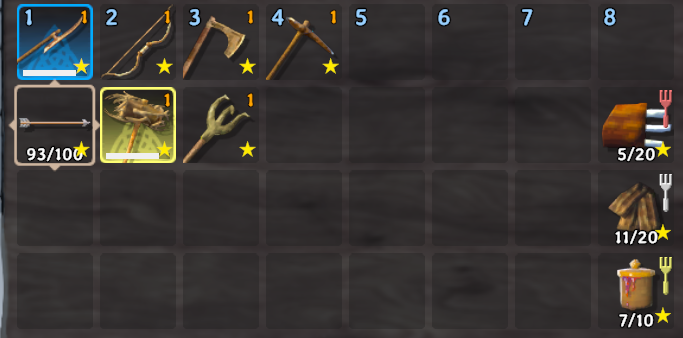
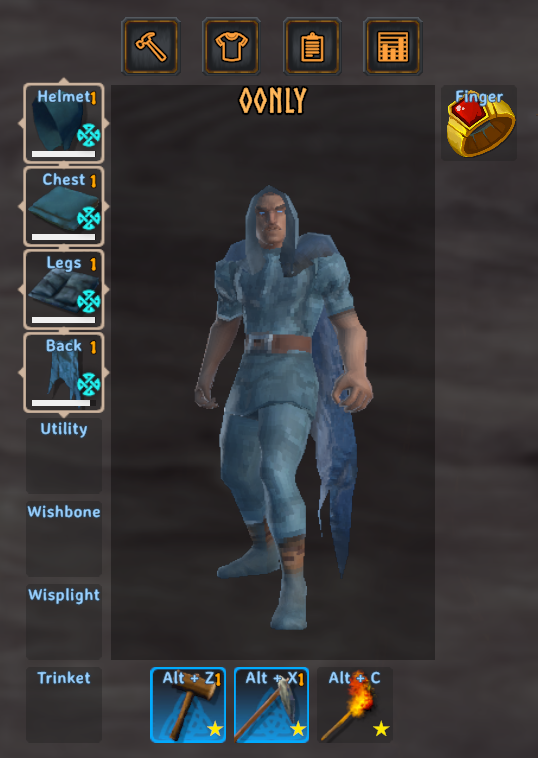

# Favorite Items

Sick of quick stacking the foods you are currently eating and tools you aren't currently using? Me too. I made this mod to give a "Terraria like" favorite item funcationilty to stop you from accidentally putting all those beloved items into a chest all the time.

Toggle favorite with a press of a key, by default the key is **LeftAlt** but can be customized to any key in the configuration file. Favorited items will have a small star in the bottom right.

## Images

 

## Mod Compatability

AzuExtendedPlayerInventory - Confirmed works
EpicLoot - No conflicts but will not stop the enchanter from showing favorited items available for sacrifice

## Info and bugs

This mod requires BepInEx Pack and is in early development, so please report any bugs or issues on the [github page](https://github.com/ZTem19/favoriteItems).
